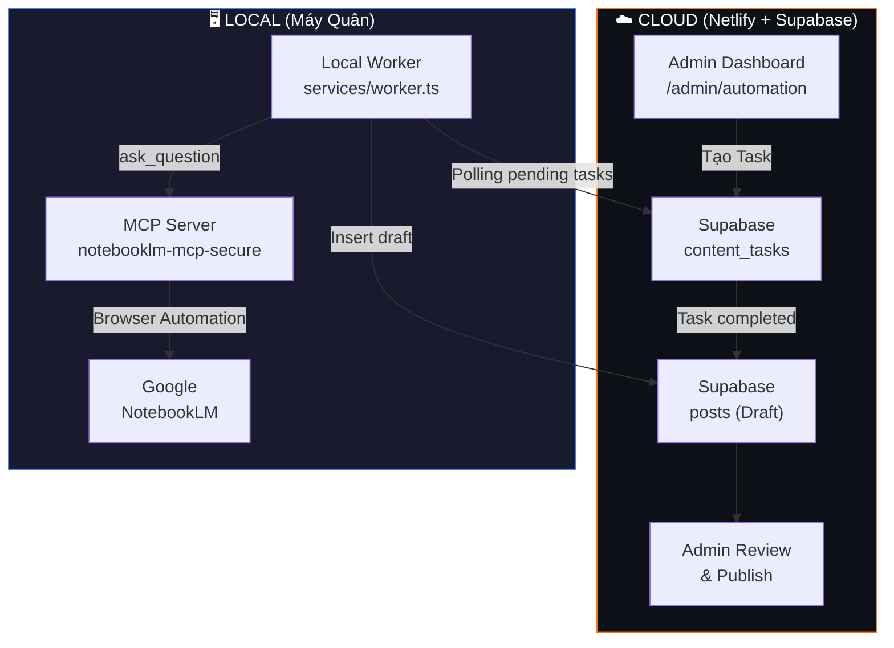

# Content OS Hybrid Mode — Tích hợp NotebookLM MCP

Chuyển đổi hệ thống AI Automation từ mô hình "Cloud-only" (Gemini + Perplexity trực tiếp) sang mô hình **Hybrid** sử dụng NotebookLM làm kho tri thức trung tâm và MCP Server chạy local làm cầu nối xử lý.

## User Review Required

> [!IMPORTANT]
> **Quyết định kiến trúc chính: Mở rộng trang `/admin/automation` hiện tại thay vì tạo trang mới.**
>
> Sau khi phân tích kỹ codebase, tôi khuyến nghị **phát triển trên Dashboard Automation hiện có** vì:
> 1. Tab **"LUỒNG XỬ LÝ"** (workflow) đang là **placeholder trống** — vị trí lý tưởng để đặt giao diện quản lý Content Tasks
> 2. Tab **"KẾT NỐI"** (connections) đã có `ConnectionHub` quản lý API Keys + MCP Nodes — chỉ cần bổ sung cấu hình NotebookLM
> 3. Tab **"TRI THỨC (MCP)"** đã có `KnowledgeHub` — tái sử dụng cho NotebookLM notebooks
> 4. Tránh phân tán UI, giữ mọi thứ automation ở **một nơi duy nhất**
>
> Ngoài ra, cần tạo thêm **1 folder `services/`** tại root project để chứa Local Worker script (chạy độc lập trên máy Quân).

> [!WARNING]
> **MCP Server `notebooklm-mcp-secure`** sử dụng **Browser Automation** (Puppeteer/Playwright) để tương tác với NotebookLM. Điều này có nghĩa:
> - MCP Server **phải chạy trên máy local** (không thể deploy lên Netlify/Vercel)
> - Cần cài Chrome/Chromium trên máy chạy Worker
> - Lần đầu tiên cần chạy `setup_auth` để đăng nhập Google thủ công

## Open Questions

> [!IMPORTANT]
> 1. **Notebook ID mặc định?** Quân đã có sẵn NotebookLM notebooks nào chưa, hay cần tạo mới từ MCP? Hệ thống có hỗ trợ nhiều notebooks (mỗi notebook = 1 lĩnh vực) không?
> 2. **Bảo mật Worker ↔ Supabase:** Đặc tả yêu cầu "chỉ Local Worker mới có quyền update status". Nên dùng **Supabase Service Role Key** cho Worker hay tạo một user riêng với RLS policy?
> 3. **Thông báo:** Đặc tả đề cập Telegram/Email notification. Quân muốn triển khai cả hai hay chỉ một?

---

## Proposed Changes

### Kiến trúc tổng quan



---

### Component 1: Database Schema

#### [NEW] `supabase/migrations/20260429_content_tasks.sql`

Tạo bảng `content_tasks` (trung tâm điều phối) và cập nhật bảng `posts`:

```sql
-- Bảng content_tasks
CREATE TABLE IF NOT EXISTS public.content_tasks (
    id UUID PRIMARY KEY DEFAULT gen_random_uuid(),
    topic_name TEXT NOT NULL,
    notebook_id TEXT,              -- NotebookLM notebook ID
    priority INT DEFAULT 5,
    status TEXT DEFAULT 'pending', -- pending | processing | completed | failed
    logs TEXT,
    result_post_id UUID,          -- FK tới posts sau khi hoàn thành
    created_at TIMESTAMPTZ DEFAULT NOW(),
    updated_at TIMESTAMPTZ DEFAULT NOW()
);

-- Cập nhật posts: thêm trường AI tracking
ALTER TABLE posts
ADD COLUMN IF NOT EXISTS is_ai_generated BOOLEAN DEFAULT false,
ADD COLUMN IF NOT EXISTS seo_keywords JSONB,
ADD COLUMN IF NOT EXISTS schema_org JSONB,
ADD COLUMN IF NOT EXISTS source_task_id UUID REFERENCES content_tasks(id);

-- RLS policies cho content_tasks
-- Admin: full access qua Dashboard
-- Worker: chỉ update status + logs (dùng service_role)
```

---

### Component 2: Local Worker (chạy trên máy Quân)

#### [NEW] `services/worker.ts`

Script Node.js chạy liên tục hoặc định kỳ trên máy local:

```
services/
├── worker.ts           # Main worker: polling + MCP interaction
├── mcp-client.ts       # MCP SDK client wrapper
├── supabase-client.ts  # Supabase client (service_role)
├── prompt-templates.ts # Prompt engineering cho NotebookLM
├── package.json        # Dependencies riêng
├── .env.example        # Template biến môi trường
└── tsconfig.json
```

**Luồng xử lý:**
1. Worker polling `content_tasks` WHERE `status = 'pending'` mỗi 30s
2. Cập nhật status → `processing`
3. Gọi MCP Client → `ask_question` trên NotebookLM với prompt engineering
4. Bóc tách JSON response → Insert vào `posts` (Draft)
5. Cập nhật `content_tasks` → `completed` + link tới post
6. (Optional) Gửi notification

**MCP Client sử dụng `@modelcontextprotocol/sdk`:**
- Tool `ask_question`: Hỏi NotebookLM viết bài dựa trên tri thức trong notebook
- Tool `list_notebooks`: Lấy danh sách notebooks có sẵn
- Tool `select_notebook`: Chọn notebook phù hợp với topic
- Tool `list_sources`: Xem nguồn tri thức trong notebook

---

### Component 3: Dashboard UI (Mở rộng `/admin/automation`)

#### [MODIFY] [page.tsx](file:///Users/mac/Downloads/QUAN-PL-HUB/src/app/admin/automation/page.tsx)

- Thêm state quản lý `contentTasks`
- Load data từ server actions mới
- Kết nối tab "workflow" với component `ContentTaskManager`

#### [NEW] `src/components/admin/automation/ContentTaskManager.tsx`

Thay thế placeholder trong tab "LUỒNG XỬ LÝ" bằng giao diện quản lý Tasks:

| Khu vực | Chức năng |
|:---|:---|
| **Order Form** | Form tạo task: Nhập topic, chọn Notebook (dropdown), đặt priority |
| **Task Queue** | Bảng danh sách tasks với status badges (pending/processing/completed/failed) |
| **Live Status** | Real-time polling status từ Supabase (hoặc Supabase Realtime subscription) |
| **Quick Actions** | Nút "Xem Draft" (link tới `/admin/posts/edit/[id]`), "Retry", "Cancel" |

#### [NEW] `src/components/admin/automation/NotebookSelector.tsx`

Dropdown chọn NotebookLM notebook:
- Lấy danh sách notebooks đã cấu hình trong `automation_settings`
- Cho phép Admin thêm notebook_id mới
- Hiển thị status connection (Local Worker online/offline)

#### [MODIFY] [ConnectionHub.tsx](file:///Users/mac/Downloads/QUAN-PL-HUB/src/components/admin/automation/ConnectionHub.tsx)

Bổ sung section cấu hình NotebookLM:
- Input `NOTEBOOK_DEFAULT_ID`: ID notebook mặc định
- Input `MCP_SERVER_URL`: URL MCP Server local (default: `stdio://`)
- Indicator trạng thái Worker (dựa trên heartbeat từ `automation_logs`)

---

### Component 4: Server Actions mới

#### [NEW] `src/app/actions/content-tasks.ts`

```typescript
// CRUD cho content_tasks
export async function createContentTask(topic: string, notebookId: string, priority?: number)
export async function getContentTasks(statusFilter?: string)
export async function updateTaskStatus(taskId: string, status: string, logs?: string)
export async function retryTask(taskId: string)
export async function cancelTask(taskId: string)
```

#### [MODIFY] [posts.ts](file:///Users/mac/Downloads/QUAN-PL-HUB/src/app/actions/posts.ts)

Cập nhật `createAIDraft` để hỗ trợ thêm fields mới:
- `is_ai_generated: true`
- `seo_keywords` (JSONB)
- `schema_org` (JSONB)
- `source_task_id` (link về content_task)

---

### Component 5: Bảo mật Worker

#### [NEW] `services/.env.example`

```env
# Supabase (Service Role - KHÔNG ĐƯỢC commit)
SUPABASE_URL=https://xxx.supabase.co
SUPABASE_SERVICE_KEY=eyJ...

# MCP Server
MCP_SERVER_COMMAND=npx @pan-sec/notebooklm-mcp@latest

# Notifications (Optional)
TELEGRAM_BOT_TOKEN=
TELEGRAM_CHAT_ID=
```

**Cơ chế bảo mật:**
- Worker dùng `SUPABASE_SERVICE_KEY` (service_role) → bypass RLS
- Dashboard dùng user auth (admin email) → RLS policy bình thường
- RLS policy mới trên `content_tasks`: Admin read/create, Service Role update status

---

## So sánh trước/sau

| Khía cạnh | Hiện tại (Cloud-only) | Mới (Hybrid) |
|:---|:---|:---|
| **Nguồn tri thức** | Local files + Google Drive | **NotebookLM** (curated knowledge) |
| **AI Engine** | Gemini API trực tiếp | NotebookLM AI (qua MCP) |
| **Xử lý nặng** | Server Actions (có risk timeout) | **Local Worker** (không timeout) |
| **Luồng duyệt** | Outline → viết → save draft | **Task queue** → Worker xử lý → Draft → Review |
| **Dashboard** | Tab workflow = placeholder | Tab workflow = **Content Task Manager** |
| **Bảo mật API** | API keys trong Supabase | API keys **chỉ trên máy local** |

---

## Thứ tự thực hiện

| # | Task | Files | Ước lượng |
|:---|:---|:---|:---|
| 1 | SQL Migration `content_tasks` + update `posts` | 1 file SQL | 🟢 Nhỏ |
| 2 | Server Actions cho content_tasks | 1 file TS mới | 🟢 Nhỏ |
| 3 | Update `createAIDraft` trong posts.ts | Modify 1 file | 🟢 Nhỏ |
| 4 | **ContentTaskManager** UI component | 1 file TSX mới | 🟡 Trung bình |
| 5 | **NotebookSelector** UI component | 1 file TSX mới | 🟢 Nhỏ |
| 6 | Update Automation Dashboard page | Modify 1 file | 🟡 Trung bình |
| 7 | Update ConnectionHub (cấu hình NotebookLM) | Modify 1 file | 🟢 Nhỏ |
| 8 | **Local Worker** (services/) | 5 files mới | 🔴 Lớn |
| 9 | Update Sidebar (không cần, đã có link Tự động hóa) | — | — |

---

## Verification Plan

### Automated Tests
1. Build check: `npm run build` — đảm bảo không break Next.js build
2. SQL migration: Chạy migration trên Supabase Dashboard
3. Worker test: Chạy `npx tsx services/worker.ts` local và tạo 1 task từ Dashboard

### Manual Verification
1. Tạo content task từ Dashboard → Kiểm tra row xuất hiện trong Supabase
2. Chạy Worker local → Kiểm tra Worker nhận task và gọi MCP
3. Sau khi Worker hoàn thành → Kiểm tra draft post xuất hiện trong `/admin/posts`
4. Review & Publish draft post

> [!NOTE]
> **Giữ nguyên pipeline cũ:** Hệ thống Gemini + Perplexity hiện tại **không bị xóa**. Nút "KÍCH HOẠT PIPELINE" vẫn hoạt động như cũ. Hybrid Mode là **bổ sung thêm**, không thay thế.
